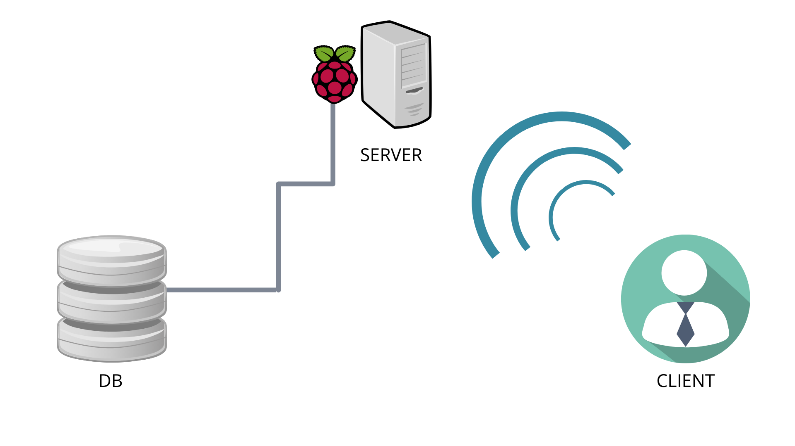

# AlphabotDB
Program to make a pc and an alphabot communicate.
The clien sends commands to the server that will execute them.
There are some predetermined movement sequences which are saved in an sqlite database on the robot.

This is the project architecture:


The db structure is:

|id|name|command|
|-:|:-|:-:|
|1|slalom|command1_duration;command2_duration;...|
|2|...|...|


```
CREATE TABLE "Movimenti" (
	"id"	INTEGER NOT NULL,
	"nome"	TEXT NOT NULL UNIQUE,
	"sequenza"	TEXT NOT NULL,
	PRIMARY KEY("id" AUTOINCREMENT)
);
```
Nicolo' Cora - Andrea Tomatis
